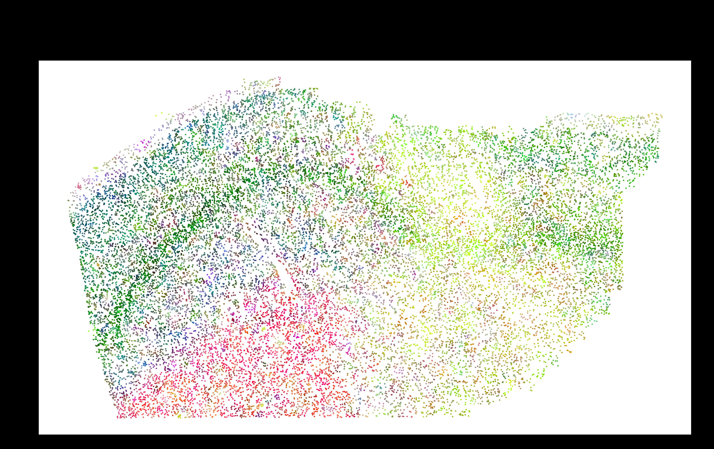

# Spatially-Aware Graph Model for Gene Expression Analysis

This project implements a self-supervised graph neural network to analyze spatial transcriptomics data. The model can be configured to use either a Graph Convolutional Network (GCN) or a Graph Attention Network (GAT) to learn latent representations of cells that incorporate both their gene expression profiles and their spatial relationships.

The full workflow is divided into four main stages:
1.  **Quality Control (QC):** Preprocessing the raw data.
2.  **Training:** Training the graph model on all datasets to learn a global representation.
3.  **Inference:** Applying the trained model to generate latent variables for each dataset.
4.  **Visualization:** Creating spatial plots of the learned latent variables.

---

## Setup and Installation

This project is designed to be run with Python 3.10.

### 1. Create a Virtual Environment

It is highly recommended to use a virtual environment to manage the project's dependencies.

```bash
python3.10 -m venv .venv
source .venv/bin/activate
```

### 2. Install Dependencies

Install the required Python packages using the `requirements.txt` file:

```bash
pip install -r requirements.txt
```

---

## Full Processing Cycle

This section describes how to run the entire analysis pipeline from start to finish. All commands should be run from the root of the project directory, with the virtual environment activated.

### Automated Pipeline Script

The easiest way to run the full pipeline is to use the provided shell script. This will execute all the steps below in sequence.

First, make the script executable:
```bash
chmod +x run_pipeline.sh
```

Then, run the script:
```bash
./run_pipeline.sh
```
You can edit the variables at the top of the `run_pipeline.sh` file to change the model type or other parameters.

### Manual Step-by-Step Instructions

If you prefer to run each step manually, follow the instructions below. All python commands should use `python3.10`.

#### Step 1: Quality Control

The first step is to process the raw `merged_metadata_and_partitions.csv` files found in each `ABN*` directory. The `qc_and_umap.py` script will perform quality control, log-normalize the gene expression data, and save the cleaned data to a new file named `processed_data_qc_only.h5ad` within each directory.

This script will automatically find and process all `ABN*` directories.

**To run:**
```bash
python3.10 qc_and_umap.py
```

#### Step 2: Training the Model

Once the data is preprocessed, you can train the graph model. The `self_supervised_graph_model.py` script will loop through all the `ABN*` directories and train a single, global model on all of the data combined.

You can choose between two model architectures: `GAT` (default) or `GCN`. You can also control several important hyperparameters.

**Key Arguments:**
*   `--model_type`: Choose the model architecture. Options: `GAT`, `GCN`. (Default: `GAT`)
*   `--decorrelation_strength`: The weight of the decorrelation loss term. A higher value encourages more spatially independent latent variables. (Default: `0.0`)
*   `--learning_rate`: The learning rate for the optimizer. (Default: `1e-3`)

**Example (training a GAT model with decorrelation):**
```bash
python3.10 self_supervised_graph_model.py --model_type GAT --decorrelation_strength 0.5
```

This will produce a trained model file, for example: `global_gat_model_with_neighbors.pt`.

#### Step 3: Running Inference

After training, you can use the saved model to run inference on all datasets. The `inference.py` script will load the frozen weights of your trained model and generate latent representations for each `ABN*` directory.

**Key Arguments:**
*   `--load_model_path`: **(Required)** The path to your saved model file (e.g., `global_gat_model_with_neighbors.pt`).
*   `--model_type`: The architecture of the saved model. Must match the model you trained. Options: `GAT`, `GCN`.

**Example (running inference with a GAT model):**
```bash
python3.10 inference.py --load_model_path global_gat_model_with_neighbors.pt --model_type GAT
```

This will create a new file in each `ABN*` directory named `processed_data_inference_latents.h5ad`, which contains the newly generated latent variables.

#### Step 4: Visualizing the Results

Finally, you can visualize the latent representations you've generated. There are two visualization scripts available.

##### Option A: Standard Visualization (`visualize_latents.py`)

This script generates a plot for each dataset independently. The colors in these plots are scaled relative to the data within each file, which makes them vibrant but **not comparable** across different datasets.

**Example:**
```bash
python3.10 visualize_latents.py --input_file processed_data_inference_latents.h5ad
```

##### Option B: Globally Consistent Visualization (`visualize_latents_globally.py`)

This script is recommended for comparing results across datasets. It performs a two-pass analysis to create a single, global color scale that is applied to all plots. This ensures that a specific color represents the same latent feature in every image, making them directly comparable.

**Example:**
```bash
python3.10 visualize_latents_globally.py --input_file processed_data_inference_latents.h5ad
```
This will generate new images with the `global_` prefix in their filenames.

### Example Output

Below is an example of a globally consistent spatial PCA visualization produced by the GAT model inference:

